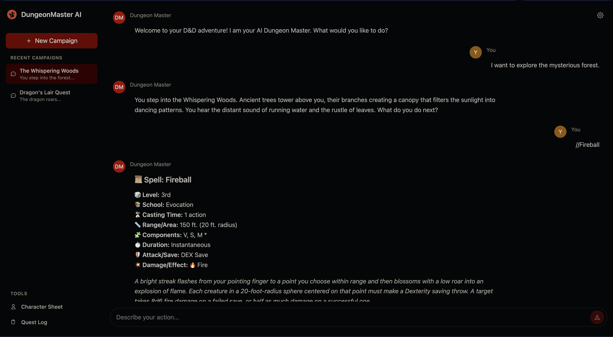

# DungeonMaster AI

A sophisticated solo D&D campaign webapp that combines the power of Large Language Models with traditional tabletop RPG mechanics to create immersive, AI-driven adventures. Built with SvelteKit, TypeScript, and Tailwind CSS.



## 🎯 Vision

DungeonMaster AI aims to democratize epic D&D experiences by providing **infinitely scalable campaigns** with the quality and grandeur of Critical Role, accessible to every player regardless of group availability or DM experience.

## 🚀 Current Features

### ✅ **Completed (Day 1-5)**
- **Modern Chat Interface**: Clean, responsive chat UI inspired by Open WebUI
- **Resizable Sidebar**: Intuitive campaign navigation with 20% screen width default
- **Markdown Support**: Rich text formatting for spells, character descriptions, and quest logs
- **Component Architecture**: Modular, reusable SvelteKit components with TypeScript
- **Real-time Messaging**: Instant message sending with loading states and typing indicators
- **D&D-Themed Design**: Custom dragon logo and D&D-appropriate color scheme

### 🎨 **Interface Highlights**
- **Campaign History & Tools**: Retractable sidebar with recent campaigns, inventory, quest log, journal, shops, and D&D tool navigation—designed for quick reference without disrupting gameplay.
- **Side Window Reference**: Character sheet and other references open in a side window, so viewing details never spams or interrupts the main game chat, similar to Perplexity's sidebar experience.
- **Emoji-Enhanced Content**: Visual spell descriptions and formatted D&D content for immersive, at-a-glance understanding.
- **Responsive Design**: Seamless experience across desktop and mobile devices.
- **Future UI Enhancements**: Planned features include shortlinks and hoverable clues for instant access to rules, character info, and context, delivering a peak UI experience for solo D&D campaigns.

## 🎲 Planned Architecture

### **Core Game Flow**
```
Player Input → Intent Analysis → Context Retrieval → Rule Validation →
Dice Processing → Consequence Application → Narrative Generation → File Updates
```

### **Key Components**

#### 🧠 **Intent Analysis Engine**
- Parse player actions and intentions from natural language
- Classify input types (combat, exploration, social interaction, spellcasting)
- Extract relevant game mechanics and rule requirements

#### 📚 **Context Retrieval System**
- Maintain campaign state and character progression
- Reference D&D 5e rules and spell databases
- Track inventory, relationships, and world state

#### ⚖️ **Rule Validation**
- Ensure actions comply with D&D 5e mechanics
- Validate spell slots, ability scores, and class features
- Apply situational modifiers and conditions

#### 🎲 **Dice Processing**
- Handle all dice rolls with proper modifiers
- Support advantage/disadvantage mechanics
- Generate critical hit/fumble outcomes

#### 📖 **Narrative Generation**
- Create immersive story responses based on outcomes
- Maintain consistent world-building and NPC personalities
- Generate dynamic encounters and plot developments

#### 💾 **Persistent State Management**
- Character sheets in markdown format for easy editing
- Campaign progress tracking and save states
- Inventory and spell slot management

## 🛠 Tech Stack

- **Frontend**: SvelteKit 5 with TypeScript
- **Styling**: Tailwind CSS v4
- **Markdown**: Marked library for rich text rendering
- **State Management**: Svelte 5 runes (`$state`, `$props`, `$effect`)
- **Build Tool**: Vite
- **Package Manager**: npm

## 📁 Project Structure

```
src/
├── lib/
│   ├── components/
│   │   ├── chat/
│   │   │   ├── ChatDisplay.svelte
│   │   │   ├── ChatInput.svelte
│   │   │   └── ChatHistory.svelte
│   │   ├── layout/
│   │   │   ├── Header.svelte
│   │   │   ├── Sidebar.svelte
│   │   │   └── Container.svelte
│   │   └── ui/
│   │       ├── Button.svelte
│   │       ├── Input.svelte
│   │       └── Card.svelte
│   ├── utils/
│   │   └── markdown.ts
│   └── types/
│       └── ui.ts
├── routes/
│   ├── +layout.svelte
│   └── +page.svelte
└── app.css
```

## 🚀 Getting Started

### Prerequisites
- Node.js 18+ 
- npm or yarn

### Installation
```bash
# Clone the repository
git clone https://github.com/yourusername/dungeonmaster-ai
cd dungeonmaster-ai

# Install dependencies
npm install

# Start development server
npm run dev
```

### Development
```bash
# Run type checking
npm run check

# Build for production
npm run build

# Preview production build
npm run preview
```

## 🎯 Roadmap

### **Phase 1: Foundation** ✅
- [x] SvelteKit setup with TypeScript and Tailwind
- [x] Chat interface with markdown support
- [x] Component architecture and responsive design
- [x] Basic message handling and UI polish

### **Phase 2: Core D&D Integration** 🚧
- [ ] Character sheet system (.md format)
- [ ] Dice rolling mechanics with modifiers
- [ ] D&D 5e rule integration
- [ ] Spell and ability tracking

### **Phase 3: AI Intelligence** 📋
- [ ] LLM integration for narrative generation
- [ ] Intent analysis and context awareness
- [ ] Dynamic encounter generation
- [ ] Persistent campaign state

### **Phase 4: Advanced Features** 🔮
- [ ] Combat system with initiative tracking
- [ ] Inventory and equipment management
- [ ] Multi-campaign support
- [ ] Character progression and leveling

### **Phase 5: Visual Enhancement** 🎨
- [ ] Map integration and exploration
- [ ] Combat sprites and visual aids
- [ ] Character portraits and tokens
- [ ] Rich media support

## 🎲 Why This Approach Works

### **Simplified Complexity**
- **Character Sheets**: Markdown format allows easy editing and version control
- **Dice Mechanics**: Random number generation with proper D&D modifiers
- **LLM Integration**: Structured prompts ensure consistent rule application
- **Visual Elements**: Creative solutions for maps and combat visualization

### **Scalable Architecture**
- **Modular Components**: Easy to extend and maintain
- **TypeScript Safety**: Prevents runtime errors and improves development experience
- **Modern Framework**: SvelteKit provides excellent performance and developer experience

### **Infinite Potential**
- **Solo Play**: No scheduling conflicts or group coordination needed
- **Epic Campaigns**: AI-driven stories can rival professional DM quality
- **Accessibility**: Makes D&D available to players without local groups
- **Customization**: Fully customizable campaigns and house rules

## 🤝 Contributing

We welcome contributions! Please see our [Contributing Guidelines](CONTRIBUTING.md) for details.

### Development Principles
- **User Experience First**: Every feature should enhance the D&D experience
- **Performance Matters**: Keep the interface responsive and fast
- **Accessibility**: Ensure the app works for all users
- **Clean Code**: Maintain readable, well-documented code

## 📜 License

This project is licensed under the MIT License - see the [LICENSE](LICENSE) file for details.

## 🙏 Acknowledgments

- **Critical Role**: Inspiration for epic D&D storytelling
- **D&D 5e**: The incredible game system that makes this possible
- **Open WebUI**: UI/UX inspiration for the chat interface
- **SvelteKit Community**: Amazing framework and ecosystem

---

*"The best campaigns are the ones that never end. With DungeonMaster AI, every adventure is just the beginning."*

## 🔗 Links

- [Live Demo](https://dungeonmaster-ai.vercel.app) (Coming Soon)
- [Documentation](https://docs.dungeonmaster-ai.com) (Coming Soon)
- [Discord Community](https://discord.gg/dungeonmaster-ai) (Coming Soon)

---

**Built with ❤️ for the D&D community**